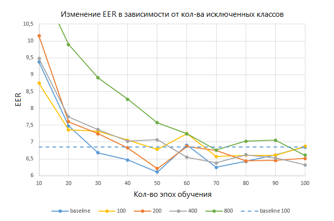

## Распознавание дикторов

Цель проекта: улучшить результат существующей модели распознавания дикторов, используя метод DropClass, описанный в статье [1].

Метод заключается в исключении из обучающей выборки некоторого количества классов через некоторое кол-во итераций с целью прироста производительности, что концептуально аналогично применению Dropout.

Измененные части кода помечены комментариями #-------.

На графике сравнение результатов работы метода DropClass и baseline во время обучения по метрике EER (Equal Error Rate) при условии, что классы исключались через каждые 2 эпохи.

  
  

---
### REFs

1. Luu, C. Dropping classes for deep speaker representation learning / C. Luu, P. Bell, S. Renals // Odyssey 2020 The Speaker and Language Recognition Workshop. — 2020. — P. 357-364.
